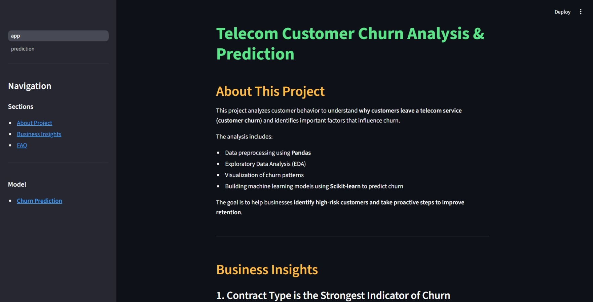
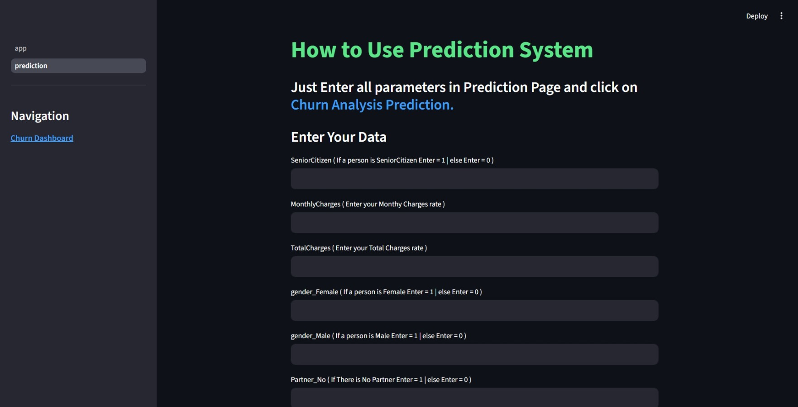

# Telecom Customer Churn Analysis & Prediction

This project analyzes telecom customer behavior to identify factors that lead to customer churn and builds a machine learning model to predict churn risk. A Streamlit dashboard is also developed to allow real-time churn prediction.

---

## Project Overview

Customer churn is a major challenge for telecom companies. Retaining existing customers is often more cost-effective than acquiring new ones.

This project performs:

- Data preprocessing using Pandas
- Exploratory Data Analysis (EDA)
- Visualization of churn patterns
- Machine learning model development using Scikit-learn
- Deployment of a churn prediction system using Streamlit

The goal is to help businesses identify high-risk customers and take proactive retention measures.

---

## Dataset

Dataset used: **Telco Customer Churn Dataset**

File: `WA_Fn-UseC_-Telco-Customer-Churn.csv`

Dataset contains:

- 7043 customer records
- 21 customer features including:
  - customer demographics
  - services subscribed
  - account information
  - billing details

Target variable: Churn (Yes / No)

---

## Project Workflow

1. **Data Cleaning & Preprocessing**
   - Handling missing values
   - Converting categorical variables
   - Feature encoding

2. **Exploratory Data Analysis**
   - Churn distribution
   - Customer tenure analysis
   - Contract type analysis
   - Monthly charges patterns

3. **Feature Engineering**

4. **Model Building**
   - Logistic Regression
   - Random Forest
   - Model evaluation

5. **Model Saving**
   - Final trained model saved as: `model.sav`


6. **Deployment**
   - Streamlit dashboard for real-time churn prediction

---

## Streamlit Dashboard

The project includes an interactive dashboard with two pages:

## Dashboard Preview

### Project Overview Page


### Prediction Page


### 1. Project Information Page
Contains:
- Project description
- Business insights
- FAQ

### 2. Prediction Page
Allows users to input customer parameters and predict churn probability.

---

## Tech Stack

- Python
- Pandas
- NumPy
- Matplotlib
- Seaborn
- Scikit-learn
- Streamlit

---

## Running the Project

### 1. Clone the repository
```bash
git clone <your-repo-link>
cd Telecom-Customer-Churn-Analysis-and-Prediction
```
---

### 2. Create a Virtual Environment (Recommended)

It is recommended to create a virtual environment to avoid dependency conflicts.
```bash
python -m venv venv
```

Activate the environment:

- **Windows:**
```bash
venv\Scripts\activate
```

- **Mac/Linux:**
```bash
source venv/bin/activate
```

---

### 3. Install dependencies
```bash
pip install -r requirements.txt
```

---

### ⚠️ Note on Compatibility

Ensure that compatible versions of **NumPy** and **Pandas** are installed.

### 3. Run the Streamlit app
```bash
streamlit run app.py
```

---

## Project Structure

Telecom-Customer-Churn-Analysis-and-Prediction/
│
├── README.md
|── requirements.txt
├── app.py
├── model.sav
├── WA_Fn-UseC_-Telco-Customer-Churn.csv
├── tel_churn.csv
│
├── images/               
│   ├── dashboard.png
│   └── prediction.png
|
├── pages/
│   └── prediction.py
│
├── Churn Analysis - EDA.ipynb
└── Churn Analysis - Model Building.ipynb

---

## Key Business Insights

Some factors that influence churn include:

- Customers with **month-to-month contracts churn more frequently**
- Customers with **higher monthly charges show higher churn probability**
- Customers with **short tenure are more likely to leave**

These insights can help telecom companies design better customer retention strategies.

---

## Some Future Improvements

- Deploy the dashboard online
- Add model explainability (SHAP / feature importance)
- Improve UI of prediction system

---

## Author

Data Analytics Project for portfolio development.


